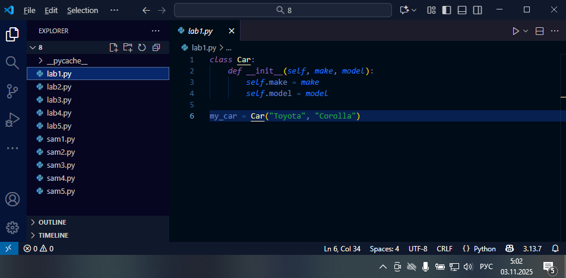
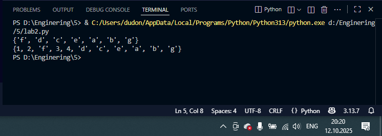

# Тема 2. Базовые операции языка Python
Отчет по Теме #2 выполнил:
- Еськин Егор Максимович
- ИВТ-23-1

| Задание | Лаб_раб | Сам_раб |
| ------ | ------ | ------ |
| Задание 1 | + | + |
| Задание 2 | + | + |
| Задание 3 | + | + |
| Задание 4 | + | + |
| Задание 5 | + | + |
| Задание 6 | + | + |
| Задание 7 | + | + |
| Задание 8 | + | + |
| Задание 9 | + | + |
| Задание 10 | + | + |

знак "+" - задание выполнено; знак "-" - задание не выполнено;

Работу проверили:
- Ассистент кафедры информационных технологий и статистики, Ротенштрайх Татьяна ВикторовнаА.

## Лабораторная работа №1
### Выведите в консоль три строки. Первая – любое число. Вторая – любое число в виде строки. Третья – любое число с плавающей точкой.

```python
print(123)
print('123')
print(1.23)
```
### Результат.


## Лабораторная работа №2
### Введите в консоль ТРИ строки. Первая - результат сложения или вычитания минимум двух переменных типа int. Вторая - результат сложения или вычитания минимум двух переменных типа float. Третья — результат сложения или вычитания минимум двух переменных типа int и float.
```python
print(1823-486)
print(5.1 + 8.27)
print(3 + 7.04 + 1 + 2.33)
```
### Результат.


## Лабораторная работа №3
- Текст задания
- Оформленный код
- Скрины консоли
- Краткие Выводы
  
## Лабораторная работа №4
- Текст задания
- Оформленный код
- Скрины консоли
- Краткие Выводы

## Лабораторная работа №5
- Текст задания
- Оформленный код
- Скрины консоли
- Краткие Выводы

## Лабораторная работа №6
- Текст задания
- Оформленный код
- Скрины консоли
- Краткие Выводы

## Лабораторная работа №7
- Текст задания
- Оформленный код
- Скрины консоли
- Краткие Выводы

## Лабораторная работа №8
- Текст задания
- Оформленный код
- Скрины консоли
- Краткие Выводы

## Лабораторная работа №9
- Текст задания
- Оформленный код
- Скрины консоли
- Краткие Выводы

## Лабораторная работа №10
- Текст задания
- Оформленный код
- Скрины консоли
- Краткие Выводы

## Самостоятельная работа №1
- Текст задания
- Оформленный код
- Скрины консоли
- Развернутый вывод
  
## Самостоятельная работа №2
- Текст задания
- Оформленный код
- Скрины консоли
- Развернутый вывод
  
## Самостоятельная работа №3
- Текст задания
- Оформленный код
- Скрины консоли
- Развернутый вывод
  
## Самостоятельная работа №4
- Текст задания
- Оформленный код
- Скрины консоли
- Развернутый вывод
  
## Самостоятельная работа №5
- Текст задания
- Оформленный код
- Скрины консоли
- Развернутый вывод
  
## Самостоятельная работа №6
- Текст задания
- Оформленный код
- Скрины консоли
- Развернутый вывод
  
## Самостоятельная работа №7
- Текст задания
- Оформленный код
- Скрины консоли
- Развернутый вывод
  
## Самостоятельная работа №8
- Текст задания
- Оформленный код
- Скрины консоли
- Развернутый вывод
  
## Самостоятельная работа №9
- Текст задания
- Оформленный код
- Скрины консоли
- Развернутый вывод
  
## Самостоятельная работа №10
- Текст задания
- Оформленный код
- Скрины консоли
- Развернутый вывод

## Общие выводы по теме
- Развернутый вывод
