# Тема 1. Работа с Git

**Отчет по Теме #1 выполнил:**

- **Еськин Егор Максимович**
- **ИВТ-23-1**

| Задание | Выполнение |
|----------|----------|
| 2.1 Установка | + |
| 2.2 Настройка | + |
| 2.3 Создание нового репозитория | + |
| 2.4 Подготовка файлов | + |
| 2.5 Фиксация изменений | + |
| 2.6 Подключение к удаленному репозиторию | + |
| 2.7 Ветвление | + |
| 2.8 Особенности применения «Фетч» | + |
| 2.9 Удаление файлов, веток, локальных и удалённых репозиториев | + |
| 2.10 Отслеживание изменений в коммитах | + |
| 2.11 Возвращение файла к предыдущему (определенному) состоянию | + |
| 2.12 Возвращение к предыдущему коммиту | + |
| 2.13 Исправление коммита | + |
| 2.14 Разрешение конфликтов при слиянии | + |
| 2.15 Настройка .gitignore | + |

знак "+" - задание выполнено; знак "-" - задание не выполнено;

Работу проверили: 

- Ассистент кафедры информационных технологий и статистики, Ротенштрайх Татьяна Викторовна

## Задание 1 - Установка

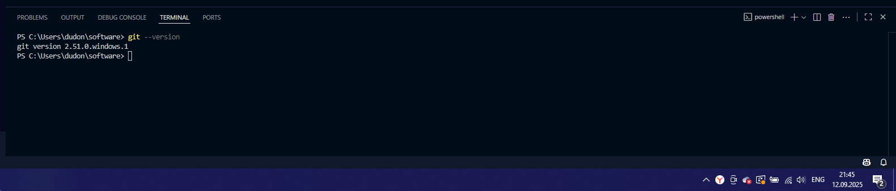

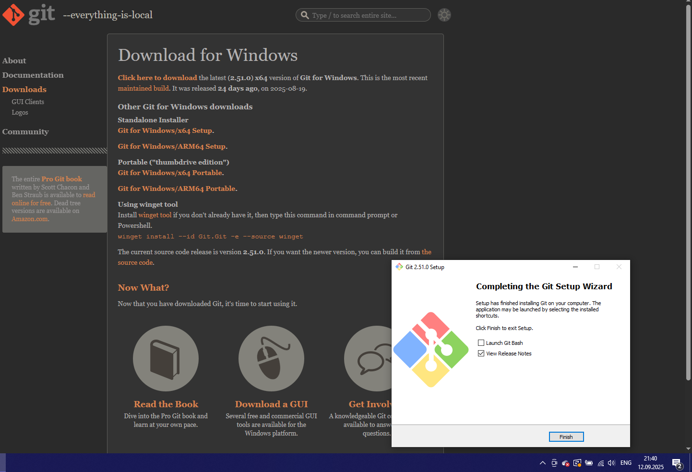

**Вывод:**
Git — кроссплатформенная система, и ее установка стандартизирована для всех основных операционных систем (Windows, macOS, Linux). Успешная установка подтверждается командой git --version, которая отображает текущую версию программы. Это первый и обязательный шаг для начала работы с системой контроля версий.

## Задание 2 - Настройка

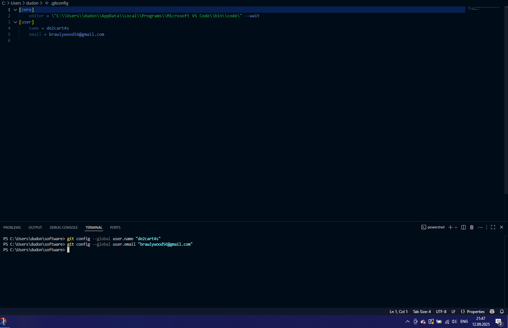

**Вывод:**
Первоначальная базовая настройка Git (имя пользователя и email) является критически важной, так как эта информация будет неотъемлемой частью каждой фиксации изменений (коммита) и позволяет идентифицировать автора. Дополнительная настройка редактора позволяет персонализировать рабочую среду под свои предпочтения.

## Задание 3 - Создание нового репозитория

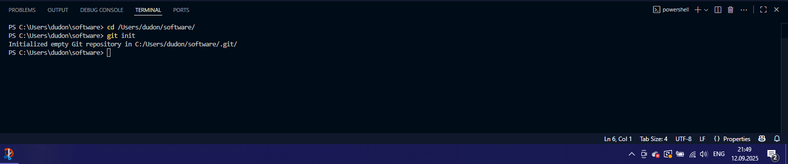

**Вывод:**
Команда git init — это отправная точка для любого нового проекта под версионным контролем. Она создает скрытую папку .git, в которой Git будет хранить всю служебную информацию и историю изменений проекта. Инициализировать репозиторий нужно только один раз для проекта.

## Задание 4 - Подготовка файлов

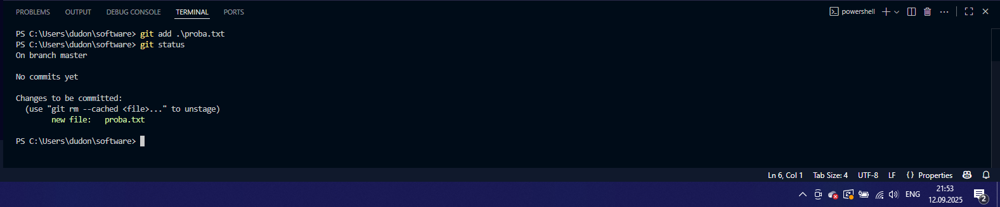

**Вывод:**
Процесс подготовки файлов с помощью git add — это ключевой этап рабочего цикла Git. Он позволяет точно выбрать, какие изменения должны быть включены в следующий коммит. Команда git status является основным инструментом для просмотра состояния файлов (отслеживаемые/неотслеживаемые, измененные/подготовленные) и контроля над процессом.

## Задание 5 - Фиксация изменений

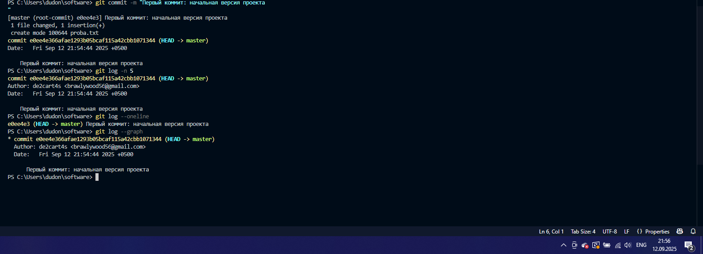

**Вывод:**
Коммит (git commit) — это атомарная единица истории проекта, которая навсегда фиксирует состояние подготовленных файлов на момент его создания. Писать осмысленные комментарии к коммитам — важнейшая практика, позволяющая понять историю изменений проекта без изучения кода. Команда git log в различных вариациях — главный инструмент для навигации по этой истории.

## Задание 6 - Подключение к удаленному репозиторию

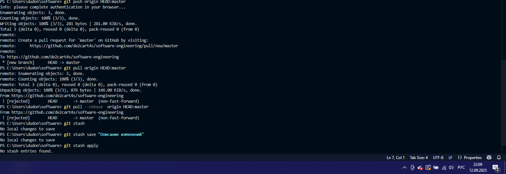

**Вывод:**
Команды git remote add, git push и git pull являются основой для совместной работы. Они связывают локальную работу на своем компьютере с общим удаленным репозиторием (например, на GitHub), позволяя публиковать свои изменения (push) и получать изменения от других участников проекта (pull). Это обеспечивает синхронизацию работы всей команды.

## Задание 7 - Ветвление

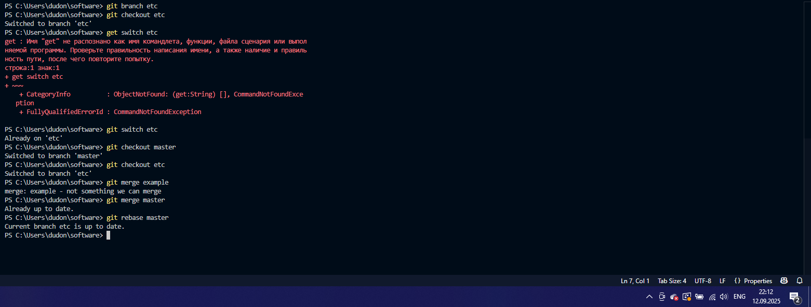

**Вывод:**
Ветвление — одна из самых мощных возможностей Git. Оно позволяет изолировать процессы разработки новых функций, исправления ошибок и экспериментов в отдельных "песочницах" (ветках), не затрагивая стабильную основную версию проекта (main/master). Это фундамент для нелинейной и параллельной разработки.

## Задание 8 - Особенности применения «Фетч»

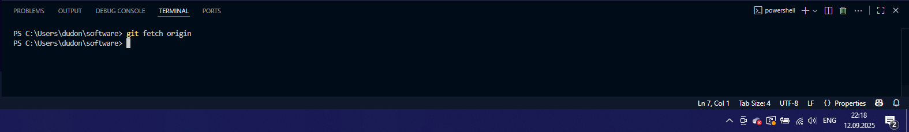

**Вывод:**
Команда Команда git fetch является "безопасным" способом синхронизации с удаленным репозиторием. В отличие от git pull, она только загружает изменения, но не объединяет их с вашей рабочей веткой. Это позволяет сначала просмотреть, что изменилось на сервере, и только потом принять осознанное решение о слиянии (merge) или перебазировании (rebase).

## Задание 9 - Удаление файлов, веток, локальных и удалённых репозиториев

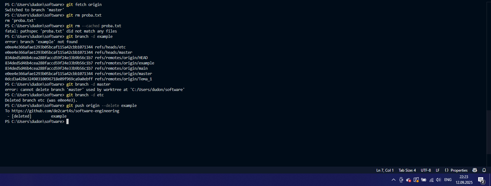

**Вывод:**
Git предоставляет инструменты для управления жизненным циклом объектов в репозитории. Важно понимать разницу между удалением файлов из индекса и рабочей директории (git rm), безопасным и принудительным удалением локальных веток (git branch -d/-D) и удалением веток на удаленном сервере (git push --delete). Удаление же всего репозитория (локального или удаленного) — это операция, выполняемая средствами файловой системы или хостинга (например, GitHub).

## Задание 10 - Отслеживание изменений в коммитах

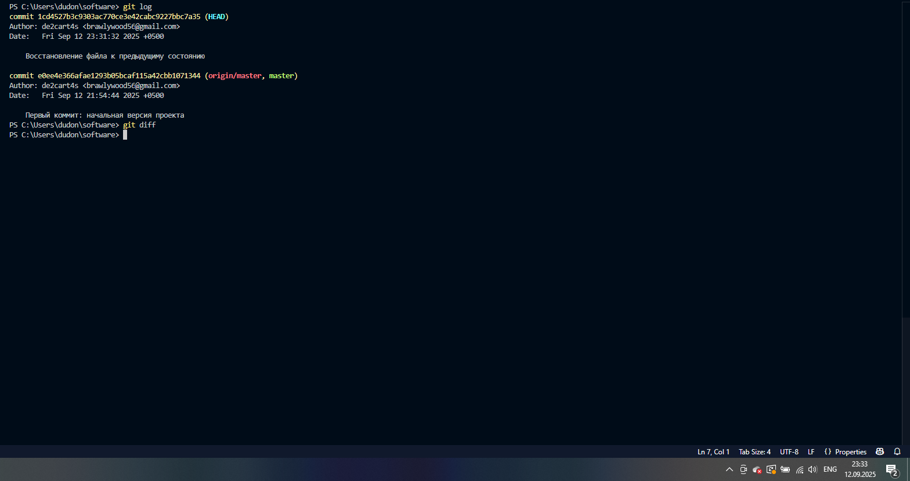

**Вывод:**
Комбинация команд git log (для просмотра истории и метаинформации) и git diff (для детального сравнения изменений между коммитами, ветками или файлами) является мощнейшим инструментом для аудита кода, отладки и анализа того, как проект развивался во времени.

## Задание 11 - Возвращение файла к предыдущему состоянию

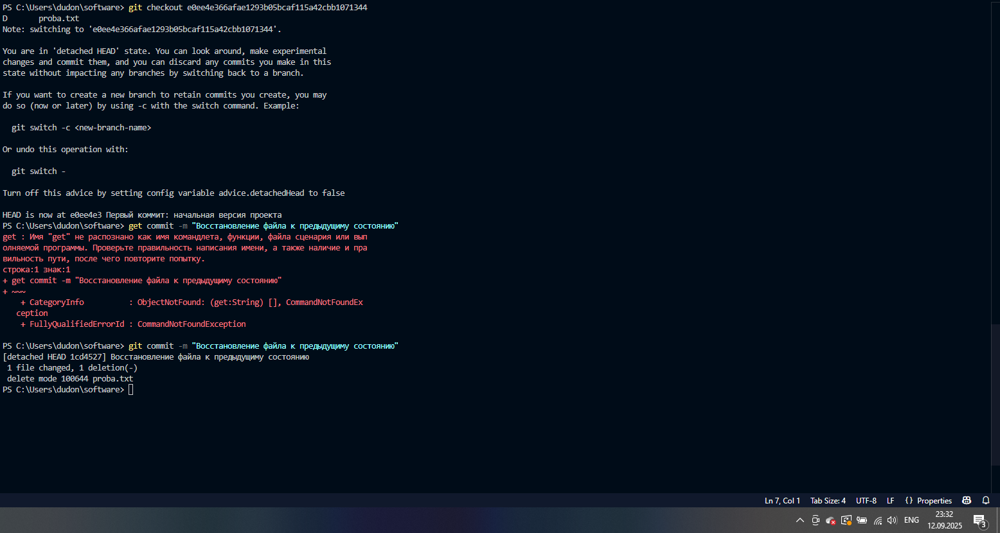

**Вывод:**
Команда git checkout (или более современная git restore) позволяет "извлечь" конкретный файл из истории проекта, effectively отменяя все изменения, которые были в него внесены после указанного коммита. Это точечный и безопасный способ исправить ошибку в отдельном файле, не затрагивая всю рабочую директорию.

## Задание 12 - Возвращение к предыдущему коммиту

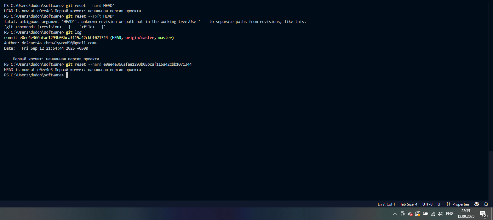

**Вывод:**
Команда git reset — это мощный и потенциально опасный инструмент для управления историей. С помощью разных флагов (--soft, --mixed, --hard) можно контролировать, будут ли изменения сохранены в рабочей директории или безвозвратно удалены. Требует четкого понимания последствий, особенно при использовании флага --hard.

## Задание 13 - Исправление коммита

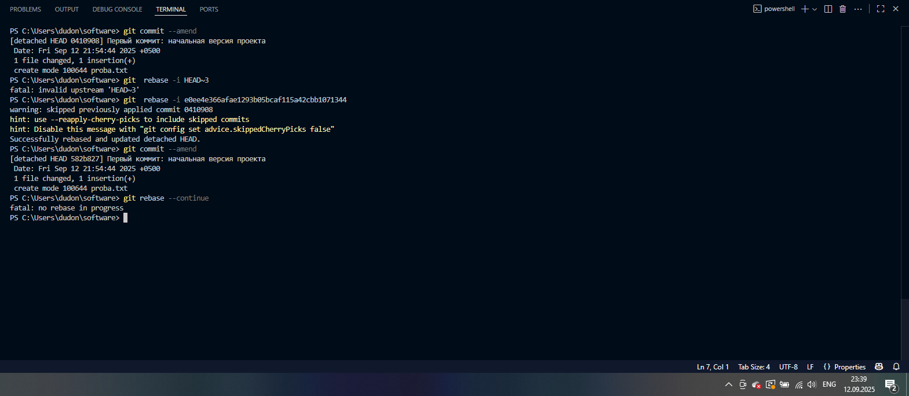

**Вывод:**
Git позволяет исправлять историю. Команда git commit --amend предназначена для быстрого исправления последнего коммита (сообщения или набора файлов). Интерактивный ребейз (git rebase -i) — это сложный, но крайне эффективный метод для переписывания истории, изменения порядка, объединения или правки более старых коммитов перед их публикацией.

## Задание 14 - Разрешение конфликтов при слиянии

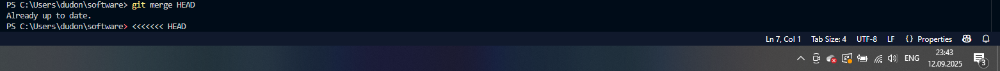

**Вывод:**
Конфликты слияния — это не ошибка, а неизбежная часть совместной работы, когда Git не может автоматически объединить изменения. Разрешение конфликтов — это ручная работа разработчика, которая требует анализа конфликтующих изменений и принятия осознанного решения о том, каким должен быть итоговый код. Процесс включает правку файлов, добавление их в индекс и завершение коммита слияния.

## Задание 15 - Настройка .gitignore

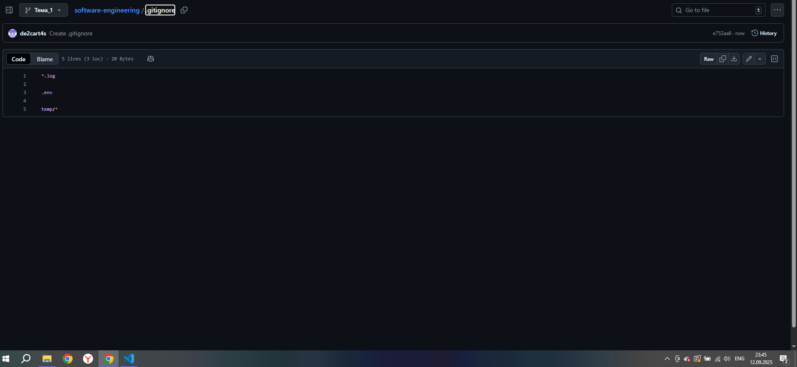

**Вывод:**
Файл .gitignore — это проактивный инструмент для поддержания чистоты и безопасности репозитория. Он предотвращает добавление в систему контроля версий ненужных, временных или конфиденциальных файлов (пароли, ключи API, бинарники, логи и т.д.). Его правильная настройка с самого начала проекта экономит время и предотвращает потенциальные проблемы с безопасностью.

