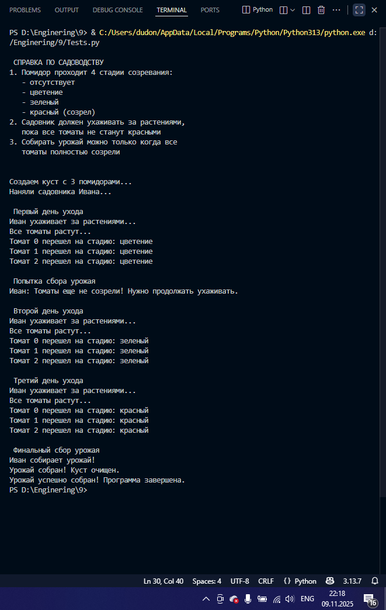

# Тема 9. Концепции и принципы ООП
Отчет по Теме #9 выполнил:
- Еськин Егор Максимович
- ИВТ-23-1

| Задание | Лаб_раб | Сам_раб |
| ------ | ------ | ------ |
| Задание 1 | + | + |
| Задание 2 | + | + |
| Задание 3 | + | + |
| Задание 4 | + | + |
| Задание 5 | + |  |

знак "+" - задание выполнено; знак "-" - задание не выполнено;

Работу проверили:
- Ассистент кафедры информационных технологий и статистики, Ротенштрайх Татьяна ВикторовнаА.

## Лабораторная работа №1
### Допустим, что вы решили оригинально и немного странно познакомится с человеком. Для этого у вас должен быть написан свой класс на Python, который будет проверять угадал ваше имя человек или нет. Для этого создайте класс, указав в свойствах только имя. Дальше создайте функцию init(), а в ней сделайте проверку на то угадал человек ваше имя или нет. Также можете проверить что будет, если в этой функции указав атрибут, который не указан в вашем классе, например, попробуйте вызвать фамилию.

``` python
class Ivan:
    __slots__ = ['name']

    def __init__(self, name):
        if name == 'Иван':
            self.name = f"Да, я {name}"
        else:
            self.name = f"Я не {name}, а Иван"


person1 = Ivan('Алексей')
person2 = Ivan('Иван')
print(person1.name)
print(person2.name)

person2.surname = 'Петров'
```

### Результат.


## Лабораторная работа №2
### Вам дали важное задание, написать продавцу мороженого программу, которая будет писать добавили ли топпинг в мороженое и цену после возможного изменения. Для этого вам нужно написать класс, в котором будет определяться изменили ли состав мороженого или нет. В этом классе реализуйте метод, выводящий на печать «Мороженое с {ТОППИНГ}» в случае наличия добавки, а иначе отобразится следующая фраза: «Обычное мороженое». При этом программа должна воспринимать как топпинг только атрибуты типа string.

```python
class Icecream:
    def __init__(self, ingredient=None):
        if isinstance(ingredient, str):
            self.ingredient = ingredient
        else:
            self.ingredient = None

    def composition(self):
        if self.ingredient:
            print(f"Мороженое с {self.ingredient}")
        else: 
            print('Обычное мороженное')

icecream = Icecream()
icecream.composition()
icecream = Icecream('шоколадом')
icecream.composition()
icecream = Icecream(5)
icecream.composition()
```
### Результат.


## Лабораторная работа №3
### Петя – начинающий программист и на занятиях ему сказали реализовать икапсу…что-то. А вы хороший друг Пети и ко всему прочему прекрасно знаете, что икапсу…что-то – это инкапсуляция, поэтому решаете помочь вашему другу с написанием класса с инкапсуляцией. Ваш класс будет не просто инкапсуляцией, а классом с сеттером, геттером и деструктором. После написания класса вам необходимо продемонстрировать что все написанные вами функции работают.
Также вас необходимо объяснить Пете почему на скриншоте ниже в консоли выводится ошибка.

```python
class MyClass:
    def __init__(self, value):
        self._value = value

    def set_value(self, value):
        self._value = value

    def get_value(self):
        return self._value
    
    def del_value(self):
        del self._value

    value = property(get_value, set_value, del_value, "Свойство value")

obj = MyClass(42)
print(obj.get_value())
obj.set_value(45)
print(obj.get_value())
obj.set_value(100)
print(obj.get_value())
obj.del_value()
print(obj.get_value()) #удаление атрибута
```
### Результат.


Происходит ошибка, потому что после удаления атрибута _value с помощью метода del_value мы пытаемся получить значение этого атрибута с помощью get_value. Но атрибут уже удален, и поэтому Python выдает ошибку AttributeError, говорящую о том, что у объекта нет атрибута _value
  
## Лабораторная работа №4
### Вам прекрасно известно, что кошки и собаки являются млекопитающими, но компьютер этого не понимает, поэтому вам нужно написать три класса: Кошки, Собаки, Млекопитающие. И при помощи "наследования" объяснить компьютеру что кошки и собаки – это млекопитающие. Также добавьте какой-нибудь свой атрибут для кошек и собак, чтобы показать, что они чем-то отличаются друг от друга.

```python
class Mammal:
    className = 'Mammal'

class Dog(Mammal):
    species = 'canine'
    sounds = 'wow'

class Cat(Mammal):
    species = 'feline'
    sounds = 'meow'

dog = Dog()
print(f"Dog is {dog.className}, but they say {dog.sounds}")
cat = Cat()
print(f"Cat is {cat.className}, but they say {cat.sounds}")
```

### Результат.


## Лабораторная работа №5
### На разных языках здороваются по-разному, но суть остается одинакововой, люди друг с другом здороваются. Давайте вместе с вами реализуем программу с полиморфизмом, которая будет описывать всю суть первого предложения задачи. Для этого мы можем выбрать два языка, например, русский и английский и написать для них отдельные классы, в которых будет в виде атрибута слово, которым здороваются на этих языках. А также напишем функцию, которая будет выводить информацию о том, как на этих языках здороваются. Заметьте, что для решения поставленной задачи мы использовали декоратор @staticmethod, поскольку нам не нужны обязательные параметры-ссылки вроде self.

```python
class Russian:
    @staticmethod
    def greeting():
        print("Привет")

class English:
    @staticmethod
    def greeting():
        print("Hello")

def greet(language):
    language.greeting()

ivan = Russian()
greet(ivan)
john = English()
greet(john)
```
### Результат.


## Самостоятельная работа №1
### Класс Tomato:

1) Создайте класс Tomato  
2) Создайте статическое свойство states, которое будет содержать все стадии созревания помидора  
3) Создайте метод __init__(), внутри которого будут определены два динамических свойства: _index (передается параметром) и _state (принимает первое значение из словаря states). После написания этого блока кода в комментарии к нему укажите какими являются эти два свойства  
4) Создайте метод grow(), который будет переводить томат на следующую стадию созревания  
5) Создайте метод is_ripe(), который будет проверять, что томат созрел

```python
class Tomato:
    states = {
        0: 'отсутствует',
        1: 'цветение', 
        2: 'зеленый',
        3: 'красный'
    }
    
    def __init__(self, index):
        """
        Инициализация объекта Tomato
        _index - защищенное свойство (protected), содержит индекс томата
        _state - защищенное свойство (protected), содержит текущую стадию созревания
        """
        self._index = index # protected свойство
        self._state = 0 # protected свойство, начальная стадия
    
    def grow(self):
        if self._state < 3:
            self._state += 1
            print(f"Томат {self._index} перешел на стадию: {Tomato.states[self._state]}")
        else:
            print(f"Томат {self._index} уже полностью созрел!")
    
    def is_ripe(self):
        return self._state == 3
    
    def get_state(self):
        return Tomato.states[self._state]

```
### Результат.
1) Создан класс Tomato
2) Создано статическое свойство states - содержит все стадии созревания помидора:'отсутствует', 'цветение', 'зеленый', 'красный'
3) Реализован метод init() с двумя динамическими свойствами: _index - приватное свойство (передается параметром, идентификатор томата), _state - приватное свойство (принимает первое значение из словаря states)
4) Создан метод grow() - переводит томат на следующую стадию созревания
5) Создан метод is_ripe() - проверяет, достиг ли томат последней стадии созревания ('красный')

## Выводы
Принципы ООП, продемонстрированные в классе:
- Инкапсуляция: Использование защищенных свойств _index и _state скрывает внутреннее состояние объекта
- Статические свойства: Словарь states является общим для всех экземпляров класса
- Поведение объектов: Методы grow() и is_ripe() определяют, как объект может изменяться и взаимодействовать

Реализация:
- Четко определен жизненный цикл томата через стадии созревания
- Контроль перехода между состояниями предотвращает некорректные изменения
  
## Самостоятельная работа №2
### Класс TomatoBush:

1) Создайте класс TomatoBush
2) Определите метод __init__(), который будет принимать в качестве параметра количество томатов и на его основе будет создавать список объектов класса Tomato. Данный список будет храниться внутри динамического свойства tomatoes
3) Создайте метод grow_all(), который будет переводить все объекты из списка томатов на следующий этап созревания
4) Создайте метод all_are_ripe(), который будет возвращать True, если все томаты из списка стали спелыми.
5) Создайте метод give_away_all(), который будет чистить список томатов после сбора урожая

```python
from Tomato import *

class TomatoBush:
    def __init__(self, num_tomatoes):
        self.tomatoes = [Tomato(i) for i in range(num_tomatoes)]  # protected свойство
    
    def grow_all(self):
        print("Все томаты растут...")
        for tomato in self.tomatoes:
            tomato.grow()
    
    def all_are_ripe(self):
        return all(tomato.is_ripe() for tomato in self.tomatoes)
    
    def give_away_all(self):
        print("Урожай собран! Куст очищен.")
        self.tomatoes = []
```
### Результат.
1) Создан класс TomatoBush
2) Реализован метод init() - принимает количество томатов и создает список объектов Tomato в свойстве tomatoes
3) Создан метод grow_all() - вызывает метод grow() для всех томатов в списке
4) Создан метод all_are_ripe() - возвращает True, если ВСЕ томаты созрели
5) Создан метод give_away_all() - очищает список томатов после сбора урожая

## Выводы
Принципы ООП, продемонстрированные в классе:
- Композиция: Класс содержит коллекцию объектов Tomato
- Агрегация: Управление группой связанных объектов
- Делегирование: Метод grow_all() делегирует вызовы методам отдельных томатов

Реализация:
- Централизованное управление группой объектов
- Возможность массовых операций над коллекцией
- Контроль целостности системы (проверка всех томатов перед сбором)

## Самостоятельная работа №3
### Класс Gardener:

1) Создайте класс Gardener
2) Создайте метод __init__(), внутри которого будут определены два динамических свойства: name (передается параметром, является публичным) и _plant (принимает объект класса TomatoBush). После написания этого блока кода в комментарии к нему укажите какими являются эти два свойства
3) Создайте метод work(), который заставляет садовника работать, что позволяет растению становиться более зрелым
4) Создайте метод harvest(), который проверяет, все ли плоды созрели. Если все, то садовник собирает урожай. Если нет, то метод печатает предупреждение
5) Создайте статический метод knowledge_base(), который выведет в консоль справку по садоводству

```python
class Gardener:
    def __init__(self, name, plant):
        self.name = name
        self._plant = plant
    
    def work(self):
        print(f"{self.name} ухаживает за растениями...")
        self._plant.grow_all()
    
    def harvest(self):
        if self._plant.all_are_ripe():
            print(f"{self.name} собирает урожай!")
            self._plant.give_away_all()
            return True
        else:
            print(f"{self.name}: Томаты еще не созрели! Нужно продолжать ухаживать.")
            return False
    
    @staticmethod
    def knowledge_base():
        print("\n СПРАВКА ПО САДОВОДСТВУ ")
        print("1. Помидор проходит 4 стадии созревания:")
        print("   - отсутствует")
        print("   - цветение") 
        print("   - зеленый")
        print("   - красный (созрел)")
        print("2. Садовник должен ухаживать за растениями,")
        print("   пока все томаты не станут красными")
        print("3. Собирать урожай можно только когда все")
        print("   томаты полностью созрели")
        print("\n")
```
### Результат.
1) Создан класс Gardener
2) Реализован метод init() с двумя свойствами: name - публичное свойство (имя садовника, передается параметром), _plant - приватное свойство (объект класса TomatoBush)
3) Создан метод work() - заставляет садовника работать (растение становится более зрелым)
4) Создан метод harvest() - проверяет созрели ли все плоды: если все созрели - собирает урожай, иначе - выводит предупреждение
5) Создан статический метод knowledge_base() - выводит справку по садоводству

## Выводы
Принципы ООП, продемонстрированные в классе:
- Ассоциация: Связь с объектом TomatoBush через композицию
- Статические методы: knowledge_base() не требует создания экземпляра
- Инкапсуляция бизнес-логики: Вся работа с растением инкапсулирована в методы садовника

Реализация:
- Разделение ответственности: садовник знает КАК работать, но не знает внутреннего устройства растений
- Контроль workflow: последовательность действий от ухода до сбора урожая

## Самостоятельная работа №4
### Тесты:

1) Вызовите справку по садоводству  
2) Создайте объекты классов TomatoBush и Gardener  
3) Используя объект класса Gardener, поухаживайте за кустом с помидорами  
4) Попробуйте собрать урожай, когда томаты еще не дозрели. Продолжайте ухаживать за ними  
5) Соберите урожай

```python
from Gardener import *
from TomatoBush import *

if __name__ == "__main__":
    Gardener.knowledge_base()
    
    print("Создаем куст с 3 помидорами...")
    bush = TomatoBush(3)
    print("Наняли садовника Ивана...")
    gardener = Gardener("Иван", bush)
    
    print("\n Первый день ухода ")
    gardener.work()
    
    print("\n Попытка сбора урожая ")
    gardener.harvest()
    
    print("\n Второй день ухода ")
    gardener.work()
    
    print("\n Третий день ухода ")
    gardener.work()
    
    print("\n Финальный сбор урожая ")
    success = gardener.harvest()
    
    if success:
        print("Урожай успешно собран! Программа завершена.")
    else:
        print("Что-то пошло не так...")
```
### Результат.


## Выводы
Тест 1: Вызов справки по садоводству
- Статический метод knowledge_base() успешно выполнен без создания экземпляра класса
- Выведена корректная информация о стадиях созревания и правилах садоводства
Результат: УСПЕШНО

Тест 2: Создание объектов классов
- Объект TomatoBush создан с 3 помидорами, каждый с уникальным индексом
- Объект Gardener создан с именем "Иван" и привязан к кусту томатов
- Все защищенные свойства инициализированы корректно
Результат: УСПЕШНО

Тест 3: Уход за кустом с помидорами
- Метод work() выполняет уход за растениями
- Все томаты последовательно проходят стадии созревания:
  День 1: "отсутствует" → "цветение"
  День 2: "цветение" → "зеленый"
  День 3: "зеленый" → "красный"
- Наблюдается корректное изменение состояний всех объектов
Результат: УСПЕШНО

Тест 4: Попытка сбора незрелого урожая
- При попытке сбора урожая на ранних стадиях выводится предупреждение
- Система корректно определяет, что не все томаты созрели
- Программа не позволяет собрать урожай преждевременно
Результат: УСПЕШНО

Тест 5: Финальный сбор урожая
- После полного созревания всех томатов урожай успешно собран
- Метод harvest() возвращает True и очищает список томатов
- Рабочий процесс завершен корректно
Результат: УСПЕШНО


Все тесты выполнены УСПЕШНО. Программа демонстрирует:
- Корректную реализацию всех требуемых классов и методов
- Стабильную работу без ошибок выполнения
- Правильную логику взаимодействия между объектами
 

## Общий вывод
### Демонстрация ключевых принципов ООП:
1) Инкапсуляция:
- Скрытие внутреннего состояния объектов (protected свойства с префиксом _)
- Предоставление публичного интерфейса для взаимодействия
- Защита данных от некорректного изменения

2) Наследование:
- Хотя в данной задаче явное наследование не использовалось, структура классов демонстрирует готовность к расширению через наследование

3) Полиморфизм:
- Единый интерфейс для работы с разными объектами (все томаты имеют методы grow() и is_ripe())
- Возможность замены объектов с одинаковым интерфейсом

4) Абстракция:
- Сокрытие сложности реализации за простыми методами (work(), harvest())
- Моделирование реальных сущностей и их взаимодействий

### Практическая значимость:
Разработанная система успешно моделирует реальный процесс садоводства, демонстрируя:
- Четкое разделение ответственности между классами
- Возможность расширения (добавление новых видов растений, садовников)
- Управление сложностью через декомпозицию на отдельные компоненты
- Гибкость архитектуры для модификации и тестирования
